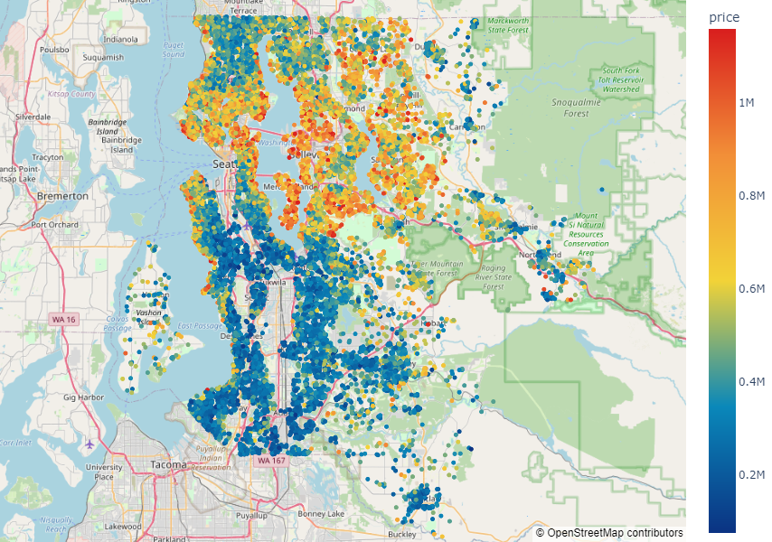
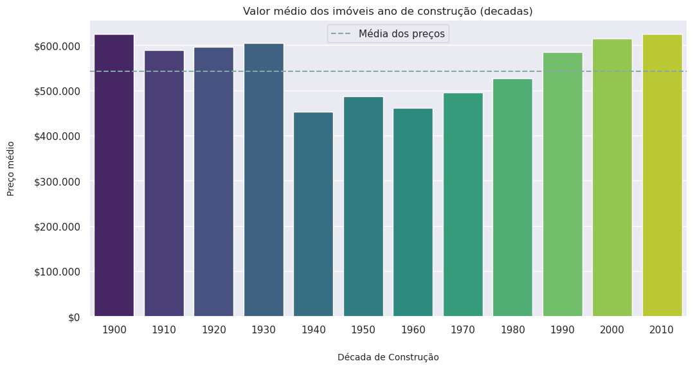
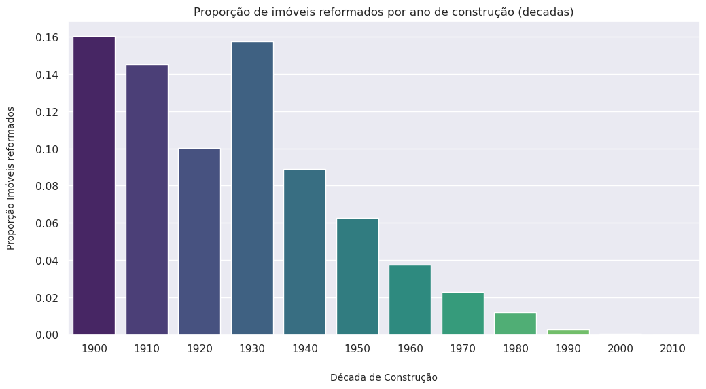
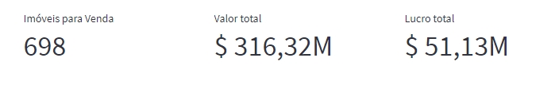

# House Rocket
> Aumento do Lucro a partir de Dados

A House Rocket (H.R.) é uma empresa de compra e venda de imóvel que atua principalmente no condado de King, no estado de Washington, EUA. Ela é uma empresa fictícia e usada aqui para ilustrar o **processo de geração de insights** através da análise e manipulação de dados para auxiliar na **tomada de decisões de negócio**.

## **1. Contexto de Negócio**

A área estratégica da House Rocket deseja encontrar as melhores oportunidades de compra e venda de imóveis para maximizar os lucros da empresa. 

O time de negócio não consegue tomar boas decisões sem analisar os dados. O portfólio é muito grande e levaria muito tempo para realizar essa análise manualmente.

### **1.1 Questões**

Foi apresentado as seguintes questões a serem respondidas com base nos dados dos imóveis encontrados no portfólio da H.R.:

1. Quais são os imóveis que a House Rocket deveria comprar e por qual preço?

2. Uma vez a casa comprada, qual o melhor momento para vendê-las e por qual preço?

### **1.2 Dados**

Os dados foram retirados do Kaggle e podem ser visto [aqui](https://www.kaggle.com/datasets/harlfoxem/housesalesprediction)

| Variável | Significado |
| --- | --- |
|id| Identificação única de cada imóvel|
|date| Data em que o imóvel ficou disponível para venda
|price| Valor de venda
|bedrooms| Número de quartos
|bathrooms| Número de banheiros, onde .5 refere-se a lavabos (i.e. sem chuveiro)
|sqft_living| Tamanho construído do imóvel em pés quadrados
|sqft_lot| Tamanho total do terreno em pés quadrados
|floors| Número de andares
|waterfront| Indica se a propriedade tem vista para a água ou não 
|view| Um índice de 0 a 4 para a qualidade da vista da propriedade, em que:  0 = sem vista, 1 = regular 2 = média, 3 = boa, 4 = excelente
|condition| Um índice de 1 a 5 para a integridade física da propriedade, em que: 1 = muito ruim, 2 = ruim, 3 = média, 4 = boa, 5= excelente
|sqft_above| O tamanho do sotão do imóvel em pés quadrados
|sqft_basement| O tamanho do porão do imóvel em pés quadrados
|yr_built| O ano em que a propriedade foi construída 
|yr_renovated| O ano em que o imóvel foi reformado pela última vez
|zipcode| O zipcode do imóvel
|lat| Latitude do imóvel
|long| Longitude do imóvel
|sqft_living15| O tamanho construido dos imóveis dos 15 vizinhos mais próximos (em pés quadrados)
|sqft_lot15| O tamanho do terreno dos imóveis dos 15 vizinhos mais próximos (em pés quadrados)

### **1.3 Premissas**
 
* Podem haver erros de digitação em alguns registros que devem ser tratados/removidos durante a limpeza dos dados.

* As variáveis `sqft_living15`, `grade` e `sqft_lot15` foram desconsideradas e removidas

* A variável `date` se refere a data em que o imóvel foi disponibilizado para venda

* Imóveis em que a variável `yr_renovated` for igual a 0, considera-se que não passou por reformas

## **2. Planejamento da Solução**

Para resolver os problemas de negócio exploramos os dados, criamos hipóteses, as validamos e os aprendizados, usamos na construção da solução, que foram entregues de acordo com a necessidade.

### **2.1 Ferramentas e Técnicas usadas**

Para resolução dos problemas apresentados foi utilizado:

* Python, Pandas, Matplotlib, Plotly, Seaborn e Geopandas
* Jupyter Notebook e VSCode
* Streamlit e Streamlit Cloud
* Git e Github
* Técnicas de estatística descritiva
* Técnicas de Exploração e Análise de Dados (EDA) 

### **2.2 Resolução dos problemas**

O seguinte raciocínio foi utilizado para a construção da solução

#### **1. Quais são os imóveis que a House Rocket deveria comprar e por qual preço?**

Para resolver esse problema, primeiramente agrupamos os imóveis por localização (`zipcode`) e encontramos o valor mediano de venda para cada região.

Com essa informação sugerimos a compra dos imóveis que preenchessem as seguintes condições:

* O Preço do imóvel esteja abaixo do valor mediano de venda da região
* O imóvel esteja em condições boa ou excelente

Para calcular o valor de oferta olhamos para a densidade de imóveis disponíveis para venda por região:

* Imóveis em região com até 204 anúncios -> Valor de compra igual ao valor anunciado
* Imóveis em região com 205 a 282 anúncios -> Valor de compra 2% menor que o anunciado
* Imóveis em região com 283 a 409 anúncios -> Valor de compra 3% menor que o anunciado
* Imóveis em região com 410 ou mais anúncios -> Valor de compra 5% menor que o anunciado

*As faixas dos anúncios foram determinados com base nos quartis do agrupamento*

#### **2. Uma vez a casa comprada, qual o melhor momento para vendê-las e por qual preço?**

Para chegar nessa resposta, agrupamos novamente o imóvel pelo `zipcode` e pegamos a estação do ano em que o imóvel foi anunciado já que o preço varia dependendo da época do ano em que o anuncio foi feito.

Com essas informações, sugerimos a venda em determinada estação do ano e pelo valor que segue a seguinte regra:

* Se o preço anunciado for maior que o preço mediano dos imóveis naquela região e na mesma estação do ano:
    * Imóveis em região com até 204 anúncios -> Valor de venda 3% maior que o anunciado
    * Imóveis em região com 205 a 282 anúncios -> Valor de venda 2% maior que o anunciado
    * Imóveis em região com 283 a 409 anúncios -> Valor de venda 1% maior que o anunciado
    * Imóveis em região com 410 ou mais anúncios -> Valor de venda 0,5% maior que o anunciado

* Se o preço anunciado for menor que o preço mediano dos imóveis naquela região e na mesma estação do ano:
    * Imóveis em região com até 204 anúncios -> Valor de venda 30% maior que o anunciado
    * Imóveis em região com 205 a 282 anúncios -> Valor de venda 20% maior que o anunciado
    * Imóveis em região com 283 a 409 anúncios -> Valor de venda 15% maior que o anunciado
    * Imóveis em região com 410 ou mais anúncios -> Valor de venda 10% maior que o anunciado

*As faixas dos anúncios foram determinados com base nos quartis do agrupamento*

### **2.3 Entregáveis**

Foi feito como entregável para esses problemas de negócios

* Tabela (csv) com imóveis a serem comprados e sugestão de preço de oferta
* Tabela (csv) com imóveis a serem vendidos e sugestão de preço de venda
* Dashboard online com as informações geradas

## **3. Principais Insights encontrados**

Os principais insights encontrados foram:

### **3.1 Os imóveis mais caros estão concentrados na região Norte e Central**

É possível perceber, ao olhar para o mapa que os imóveis com maior preço (> $600k) se encontram na região central e norte. 

### **3.2 Imóveis construidos entre 1940 e 1980 são 15% mais baratos**

Ao agruparmos os imóveis por data de contrução percebemos que aqueles que foram construídos entre 1940 e 1980 são, em média, 15% mais baratos

### **3.3 Imóveis construidos na década de 30 tem uma proporção maior de reformas**

Há um aumento abrupto na proporção de imóveis reformados e que foram construídos na decada de 30 (1930 à 1939). Cerca de 16% dos imóveis construídos nessa época foram reformados em algum momento, valor semelhante aos cosntruidos no começo do século 20

## **4. Resultados (ROI - Return on Investment)**

Caso todos os imóveis que foram comprados, assim como sugerido, sejam vendidos posteriormente, a House Rocket terá um lucro estimado de **$ 51 milhões**

## **5. Conclusão**

A análise dos dados trouxeram informações valiosas para que a área responsável possa tomar a decisão de qual imóvel comprar e qual venda.

Mais do que apenas indicar os imóveis, conseguimos modelar uma lógica de precificação baseado na densidade de anúncios por região e pela sazonalidade para a venda

## **6. Próximos Passos**

Como próximos passos, sugerimos:

* Aprofundar a lógica de precificação adicionando mais registros (inclusive de outros peíodos que não apenas 2014 e 2015)
* Treinar modleos de ML para estimar valores de compra e venda com base em certas características